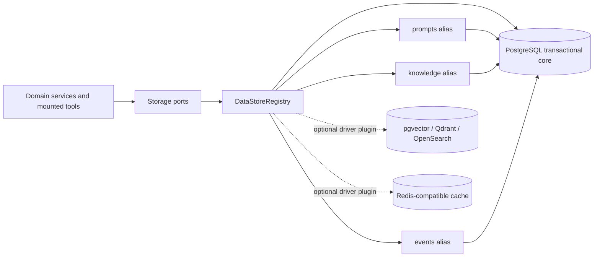
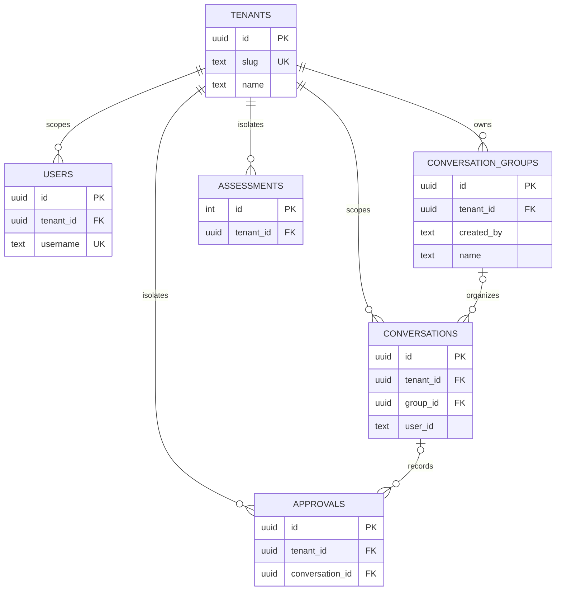
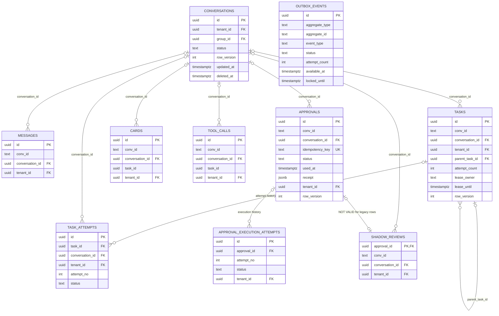
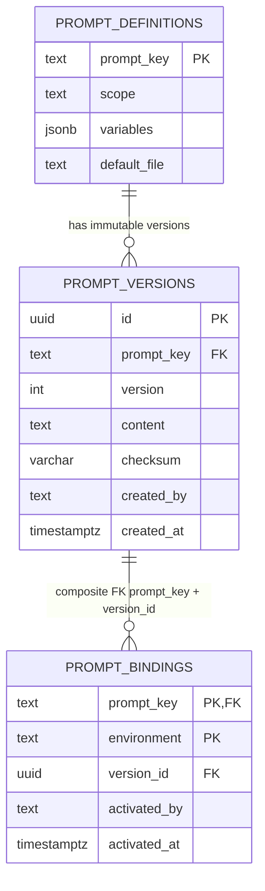

# Database architecture v2 - as built

Trạng thái kiểm chứng ngày **2026-08-24** trên live Postgres 15.19 `shb`:

| Hạng mục | Trạng thái |
|---|---|
| Alembic | `9f3a2b7c4d10` (head) |
| Physical schema | 42 public base tables (gồm `alembic_version`), 43 foreign keys |
| Live data size | 22 MB; bảng lớn nhất `interaction_notes` 9.960 KiB / 2.215 rows |
| Identity | 35 `parties`; không có owner reference mồ côi |
| Tenant foundation | 1 tenant mặc định; 0 `tenant_id` null và 0 child/conversation tenant mismatch |
| Conversation groups | Bảng + API/UI đã active; live hiện 0 group, 85 conversations đã backfill |
| Prompt catalog live snapshot | 18 definitions, 18 immutable versions, 18 active bindings |
| Approval invariant | 0 vi phạm `used <=> receipt + used_at`; 0 duplicate idempotency key |
| Migration safety | D-79 fresh upgrade, downgrade về `4b6f0d1a8c23`, re-upgrade và live upgrade đều pass |

Không row legacy nào bị xóa. Migration dùng additive columns, backfill phần map được, trigger
dual-write và nullable FK để có cửa sổ chuyển đổi an toàn.

Backup custom dump 6,6 MB (SHA-256
`ca5d8a3d300f6aead3b780cb4c990d9af1cd34cbc9fb5d2c2ce70c46d9410132`) là mốc trước đợt
D-76. Migration D-79 chỉ additive/backfill và đã được thử rollback trên DB test tách biệt.

## Quyết định kiến trúc

Postgres tiếp tục là **transactional core** cho tiền, workflow, approval và audit. Đổi toàn bộ core
sang document/vector/cache DB sẽ làm mất lợi thế transaction đúng tại invariant quan trọng nhất.
Polyglot persistence được mở theo capability: chỉ knowledge, cache, search hoặc event delivery mới
có thể tách sang store chuyên dụng, và store đó không trở thành nguồn sự thật của tiền.



`configs/datastores.json` là topology, không chứa secret. DSN và adapter options lấy gián tiếp từ
environment. Driver tích hợp hiện có là PostgreSQL, Redis, Qdrant và SQLite cho tooling; driver ngoài
đăng ký qua Python entry point `bank_digital.datastores`. Profile Compose `scale` triển khai Redis và
Qdrant thật: Redis chỉ cache kết quả `notes_search` TTL 60 giây, Qdrant giữ index vector dẫn xuất của
`interaction_notes`. Khi hai URL không được cấu hình, tool giữ nguyên fallback PostgreSQL/LAB.

PostgreSQL adapter dùng một threaded pool trên mỗi process. Kết nối mới có timeout và khi pool đầy,
caller chờ có giới hạn trước khi nhận `PoolError`; prompt sync dùng transaction advisory lock để
hai replica startup không cùng cấp một version number. Connection budget phải tính theo
`replicas * SHB_DB_POOL_MAX` cộng migration/job vận hành, không chỉ nhìn pool của một process.

## Multi-tenant foundation và nhóm hội thoại (D-79)

`tenant_id` là khóa server-owned lấy từ account/JWT, không nhận từ body hay query. Nó đã được đóng
dấu `NOT NULL + FK` trên users, conversations, messages, tasks, cards, approvals, tool calls,
assessments, shadow reviews, attempts và case-intake ledger. Trigger dual-write giữ child cùng
tenant với conversation; assessment do tool LAB ghi nhận tenant qua `set_config` transaction-local.

`conversation_groups` là thư mục UX, không phải case, team chat hay orchestration boundary. Một
conversation thuộc tối đa một group; xóa group đặt `group_id=NULL` trong cùng transaction và không
xóa conversation. Tên group unique không phân biệt hoa thường trong phạm vi
`(tenant_id, created_by)`.



Giới hạn có chủ đích của P0:

- Chưa bật RLS: pool/tool path hiện chưa bảo đảm mọi transaction đều set tenant context. API/service
  lọc tenant và DB dùng FK/trigger; chỉ bật RLS sau khi có connection hook + test fail-closed.
- Username, Google subject và source case-intake vẫn unique toàn hệ; service credential intake hiện
  map vào tenant mặc định. Đây chưa phải control plane tự cấp tenant.
- Dữ liệu nghiệp vụ LAB seed (customers, loans, wiki...) vẫn là reference/demo dùng chung. D-79 cô
  lập workspace và operational ledger, chưa tuyên bố data plane SaaS hoàn chỉnh.
- `tenant_id` tạo routing/partition key, nhưng không tự phân tải. Queue, SSE và SDK session vẫn local
  process; replica/shard chỉ được bật sau benchmark và shared-session/outbox runtime.

## ERD identity và dữ liệu nghiệp vụ

`owner_id` text vẫn được giữ cho contract LAB/API. `party_id` là FK mới được trigger đồng bộ khi
owner đã tồn tại; profile customer/business dùng chính PK của `parties`.

```mermaid
erDiagram
  PARTIES {
    text owner_id PK
    text party_type
    text display_name
    timestamptz created_at
    timestamptz updated_at
  }
  CUSTOMERS {
    varchar id PK, FK
  }
  BUSINESSES {
    varchar id PK, FK
  }
  USERS {
    uuid id PK
    text owner_id
    text party_id FK
  }
  LOANS {
    varchar loan_id PK
    varchar owner_id
    text party_id FK
  }
  CIC_RECORDS {
    varchar owner_id PK
    text party_id FK
  }
  COLLATERALS {
    varchar id PK
    varchar owner_id
    text party_id FK
  }
  OWNER_DOCUMENTS {
    varchar owner_id PK
    text doc_code PK
    text party_id FK
  }
  POLICE_RECORDS {
    text owner_id PK
    text party_id FK
  }
  EMPLOYMENT_RECORDS {
    text owner_id PK
    text party_id FK
  }
  ASSESSMENTS {
    int id PK
    text owner_id
    text party_id FK
  }
  APPLICATIONS {
    text id PK
    text owner_id
    text party_id FK
  }
  INTERACTION_NOTES {
    int note_id PK
    text owner_id
    text party_id FK
    bytea embedding
  }
  PARTY_RELATIONS {
    text from_id PK
    text to_id PK
    text from_party_id FK
    text to_party_id FK
  }

  PARTIES ||--o| CUSTOMERS : "hard profile FK"
  PARTIES ||--o| BUSINESSES : "hard profile FK"
  PARTIES o|--o{ USERS : "dual-written party_id"
  PARTIES o|--o{ LOANS : "dual-written party_id"
  PARTIES o|--o{ CIC_RECORDS : "dual-written party_id"
  PARTIES o|--o{ COLLATERALS : "dual-written party_id"
  PARTIES o|--o{ OWNER_DOCUMENTS : "dual-written party_id"
  PARTIES o|--o{ POLICE_RECORDS : "dual-written party_id"
  PARTIES o|--o{ EMPLOYMENT_RECORDS : "dual-written party_id"
  PARTIES o|--o{ ASSESSMENTS : "dual-written party_id"
  PARTIES o|--o{ APPLICATIONS : "dual-written party_id"
  PARTIES o|--o{ INTERACTION_NOTES : "dual-written party_id"
  PARTIES o|--o{ PARTY_RELATIONS : "from/to party FK"
```



## ERD workflow, idempotency và outbox

`conv_id` text vẫn phục vụ SDK folder/SSE/test. `conversation_id` UUID là hard FK mới. Row legacy
không có conversation cha giữ `conversation_id=NULL` và xuất hiện trong issue view; write có UUID
hợp lệ được trigger dual-write tự động.



Các relation `cards/tool_calls/approvals.task_id` vẫn soft trong release này để không phá audit
legacy. `outbox_events.aggregate_id` cố ý là soft reference vì một event có thể sống lâu hơn row
nguồn và phục vụ nhiều aggregate type.

## ERD prompt catalog

Prompt không còn bị khóa vào hằng string trong code. File repo là fallback/review source;
`prompt_versions` là immutable content theo checksum, còn `prompt_bindings` chọn version active
theo environment.



## Dữ liệu legacy cần xử lý

`operational_data_issues` là read-only view để làm sạch có kiểm soát:

| Issue | Table | Rows |
|---|---|---:|
| missing conversation | approvals | 174 |
| missing conversation | cards | 262 |
| missing conversation | shadow_reviews | 52 |
| missing conversation | tasks | 56 |
| missing conversation | tool_calls | 81 |
| missing approval | shadow_reviews | 4 |

Các row này chủ yếu là fixture/audit cũ. FK `shadow_reviews.approval_id` được tạo `NOT VALID`: DB
chặn orphan mới nhưng chưa validate bốn row cũ. Chỉ validate sau khi owner dữ liệu phân loại row
nào cần re-parent, archive hoặc purge; migration không tự đoán.

`alembic check` hiện chưa thể dùng làm zero-drift gate toàn repo: metadata SQLAlchemy cố ý chưa mô
hình hóa một số bảng LAB/retrieval (`wiki_*`, police/employment, interaction notes...) và thiếu một
số index/FK name đã có từ migration D-76, nên autogenerate đề xuất drop sai. D-79 đã bổ sung model
cho `assessments` và khớp tenant FK/default/index của phần mới. Không được chạy migration
autogenerate từ output này cho tới khi baseline metadata cũ được hoàn thiện hoặc `include_object`
được giới hạn rõ trong runbook.

## Đánh giá scale thực tế

| Mức | Đánh giá sau migration | Việc còn thiếu trước khi tuyên bố đạt |
|---|---|---|
| Một process / vận hành pilot | Tốt hơn rõ rệt | backup định kỳ, monitoring, least-privilege DB roles |
| Nhiều tenant trên một deployment | Tenant-ready cho workspace/ledger | provisioning, RLS connection hook, tenant-aware intake và test penetration |
| Nhiều API replica | Chưa sẵn sàng end-to-end | shared SDK/session strategy, task claimer, event fanout |
| Worker cứu task sau restart | Schema-ready, runtime chưa active | `SKIP LOCKED`, lease heartbeat, attempt writer, retry policy |
| Event bền/replay | Có bảng, chưa có publisher | ghi outbox cùng transaction, publisher, dead-letter/runbook |
| Search 2.215 interaction notes | Qdrant scale profile + Redis cache đã có | backfill, latency/load benchmark và SLO trước go-live bank DC |
| Bank production HA/DR | Chưa đạt chỉ bằng migration | PITR/WAL archive, replica/failover, restore drill định kỳ, RPO/RTO |

Điểm nghẽn kế tiếp không phải số bảng: queue/SSE và SDK session còn in-process/local disk. Chỉ tăng
replica API lúc này có thể làm một ca nằm ở process khác với session/event của nó. Schema lease và
outbox là nền cần thiết, chưa phải bằng chứng runtime đã scale ngang.

## Lộ trình scale vận hành

1. **P0 - áp dụng rồi:** pool chung có connect/acquire timeout, hard FK dual-write, idempotency
   unique, receipt check, prompt versioning có startup lock và issue view. Đưa backup/PITR, metrics
   connection/lock/slow query và DB role riêng vào runbook production.
2. **P1 - trước replica thứ hai:** triển khai task claim bằng `FOR UPDATE SKIP LOCKED`, ghi attempt,
   transactionally insert outbox ở mọi writer, chạy publisher có retry/dead-letter, và chuyển
   transcript/session sang shared storage hoặc sticky ownership có failover.
3. **P2 - khi đọc nặng:** tách dashboard/report sang read replica; partition audit theo retention
   sau khi size/index/vacuum cho thấy cần; đặt PgBouncer khi tổng pool của replicas áp sát connection
   budget.
4. **P3 - specialist stores theo bằng chứng:** pgvector là bước ít vận hành nhất khi vector vẫn cần
   transaction gần core; Qdrant đã được kích hoạt cho `interaction_notes` vì cosine scan cũ là O(N)
   mỗi request. OpenSearch chỉ thêm khi có SLO full-text/audit riêng; Redis chỉ làm
   cache/rate-limit/fanout, không giữ trạng thái chuẩn của approval hay tiền.

## Thêm datastore mới

1. Implement `DataStore` và port cần thiết trong `backend/app/storage/contracts.py`.
2. Export factory qua entry point group `bank_digital.datastores`; application không import vendor.
3. Thêm store vào `configs/datastores.json` với `dsn_env` và `options_env`, rồi trỏ alias capability
   sang store đó. Secret chỉ nằm trong environment/secret manager.
4. Chọn failure policy: core/approval luôn `required`; knowledge/cache phụ có thể optional và phải
   degrade rõ ràng.
5. Thêm healthcheck/readiness, contract tests, migration/backfill/dual-read và load test trước cutover.
6. Giữ Postgres outbox/checkpoint để rebuild specialist store; không dual-write hai DB tùy tiện trong
   request transaction.

ERD vật lý có thể tái tạo trực tiếp từ catalog:

```bash
cd backend
DATABASE_URL=postgresql://... uv run python \
  ../.codex/skills/database-erd/scripts/postgres_erd.py --tables conversations,tasks,approvals
```

Thiết kế đích dài hạn chưa áp dụng hết (policy history, typed legacy timestamps, multi-collateral)
vẫn nằm trong [`db-erd-operational-target.md`](db-erd-operational-target.md) và
[`db-erd-operational-supporting.md`](db-erd-operational-supporting.md).
