# Database DDL + ERD — trạng thái đang chạy

Kiểm chứng ngày **2026-08-25** từ live PostgreSQL, migrations và SQLAlchemy metadata. Đây là
ảnh chụp **as-built**, không phải target/backlog.

## Artefact

- [`database-schema-ddl.sql`](database-schema-ddl.sql): DDL schema-only có thể đọc/restore bằng
  `psql`; gồm tables, view, functions, triggers, constraints và indexes, không chứa row data.
- [`db-erd-overview.svg`](assets/database/db-erd-overview.svg): bản đồ domain, SVG zoom không vỡ.
- [`db-erd-overview.png`](assets/database/db-erd-overview.png): preview PNG độ phân giải cao.
- [`db-erd-physical-full.svg`](assets/database/db-erd-physical-full.svg): ERD vật lý đủ cột và đúng
  44 foreign keys từ catalog.
- [`db-erd-physical-full.png`](assets/database/db-erd-physical-full.png): bản PNG lớn để xem nhanh
  khi công cụ không mở SVG.
- [`db-erd-physical-full.mmd`](assets/database/db-erd-physical-full.mmd): Mermaid source sinh trực
  tiếp bởi skill `database-erd`.

## Bằng chứng schema

| Hạng mục | Kết quả |
|---|---:|
| PostgreSQL | 15.19, UTC |
| Alembic live / migration head | `e6f9b2c4d105` / `e6f9b2c4d105` |
| Base tables / read-only views | 43 / 1 |
| Columns (gồm view) | 379 |
| Hard foreign keys | 44 |
| Indexes | 109 |
| Database size | 21 MB |
| Bảng lớn nhất | `interaction_notes`: 2.215 rows, 9.536 KiB |

Migration files và live revision không lệch. Tuy nhiên `alembic check` **không phải zero-drift gate
hợp lệ ở repo hiện tại**: ORM metadata cố ý chưa model hóa đầy đủ các bảng LAB/retrieval và một số
index/FK đã có trong migration, nên autogenerate đề xuất drop sai. Migrations vẫn là physical source
of truth, đúng comment đầu `backend/app/db/models.py`.

Lưu ý trạng thái worktree lúc kiểm tra: revision `e6f9b2c4d105` đang tồn tại dưới dạng file chưa
được Git track nhưng đã được apply vào live DB. Artefact này phản ánh **DB đang chạy**, không tự
commit hoặc thay đổi revision đó.

## Quan hệ soft đã tách riêng

Đường nét đứt trong overview là tham chiếu nghiệp vụ, không phải FK. Nhóm quan trọng:

- `conversations.user_id → users.username`;
- `cards/tool_calls/approvals.task_id → tasks.id`;
- `approvals.system_assessment_id → assessments.id`;
- `applications.product_id/collateral_id → products.id/collaterals.id`;
- `disbursements/procedure_steps.application_id → applications.id`;
- `collateral_legal.collateral_id → collaterals.id`;
- `wiki_links.from_page/to_page → wiki_pages.id`;
- `outbox_events.aggregate_id` là polymorphic reference có chủ đích.

## Kiểm tra chất lượng dữ liệu

26 phép kiểm read-only đều trả **0 vi phạm**: orphan conversation/soft-reference, duplicate
approval idempotency key, duplicate integration event, tenant mismatch và invariant tiền
`approval.status='used' ⇔ receipt + used_at`. View `operational_data_issues` cũng trả 0 row.

Điểm cần theo dõi, chưa phải lỗi dữ liệu hiện tại:

- Chín cột thời gian của dữ liệu LAB vẫn là `text`: `applications.created_at`,
  `assessments.created_at`, `disbursements.executed_at`, `employment_records.verified_at`,
  `interaction_notes.ts`, `procedure_steps.done_at` và ba cột ngày/crawl của `wiki_pages`.
- Schema đã có lease/attempt/outbox cho scale nhiều worker, nhưng SPEC hiện ghi outbox mới là nền
  P1; queue, SSE và SDK session vẫn có phần local-process. Không được suy từ DDL rằng runtime đã HA.
- `interaction_notes` chiếm phần lớn dung lượng nhưng mới 2.215 rows; chưa có bằng chứng cần
  partition. Vector/search store chỉ nên bật theo benchmark và runbook D-76.

## Trạng thái thay đổi

Việc xuất DDL/ERD là read-only và không sửa row nghiệp vụ. Riêng migration
`e6f9b2c4d105` đã được thêm và apply để khóa `tenant_id` bất biến trên 15 bảng vận hành; migration
có downgrade đối xứng và đã được kiểm tra hai chiều trên DB test. Dữ liệu hội thoại/phiếu trong DB
demo là dữ liệu phát sinh có chủ đích từ lượt E2E, không phải do công cụ sinh ERD.
