# DB ERD vận hành - policy, pháp lý và retrieval

> Đây vẫn là **target/backlog**. Phần `parties` + nullable party FK đã áp dụng; policy version,
> append-only check history và typed timestamps bên dưới chưa có trong live schema. Xem trạng thái
> as-built tại [`db-architecture-v2.md`](db-architecture-v2.md).

Đây là phần tiếp theo của [`db-erd-operational-target.md`](db-erd-operational-target.md). Các bảng
dưới đây dùng chung `parties` và policy version để dữ liệu kiểm tra có FK, lịch sử và nguồn áp dụng.

```mermaid
erDiagram
  PARTIES {
    text owner_id PK
  }

  POLICY_VERSIONS {
    uuid id PK
    text policy_code
    int version
    text status
    text checksum
    timestamptz effective_from
    timestamptz effective_to
  }

  POLICY_PARAMETERS {
    uuid policy_version_id PK, FK
    text key PK
    jsonb value
  }

  DOCUMENT_TYPES {
    text code PK
    text name
  }

  LEGAL_REQUIREMENTS {
    uuid policy_version_id PK, FK
    text loan_type PK
    text doc_code PK, FK
    bool mandatory
  }

  OWNER_DOCUMENTS {
    text owner_id PK, FK
    text doc_code PK, FK
    text status
    timestamptz verified_at
  }

  CIC_RECORDS {
    uuid id PK
    text owner_id FK
    int cic_group
    text history_note
    text source
    timestamptz checked_at
  }

  POLICE_RECORDS {
    uuid id PK
    text owner_id FK
    text criminal_status
    text source_ref
    timestamptz checked_at
  }

  EMPLOYMENT_RECORDS {
    uuid id PK
    text owner_id FK
    text employer
    bigint verified_income_vnd
    text status
    timestamptz checked_at
  }

  ASSESSMENTS {
    uuid id PK
    text owner_id FK
    text application_id FK
    uuid policy_version_id FK
    text lane
    jsonb criteria
    text basis
    timestamptz created_at
  }

  COLLATERAL_LEGAL {
    text collateral_id PK, FK
    text dispute_status
    text zoning_status
    timestamptz checked_at
  }

  RESTRICTED_PURPOSES {
    text purpose_code PK
    uuid policy_version_id FK
    text restriction
    text legal_basis
  }

  WIKI_PAGES {
    text id PK
    text role
    text title
    date effective_from
    date effective_to
    text status
    text body
    text source_url
    timestamptz crawled_at
  }

  WIKI_LINKS {
    text from_page PK, FK
    text to_page PK, FK
  }

  INTERACTION_NOTES {
    bigint note_id PK
    text owner_id FK
    timestamptz ts
    text channel
    text note_text
    bytea embedding
  }

  PARTY_RELATIONS {
    text from_owner_id PK, FK
    text to_owner_id PK, FK
    text relation PK
    numeric pct
    timestamptz valid_from
    timestamptz valid_to
  }

  POLICY_VERSIONS ||--o{ POLICY_PARAMETERS : contains
  POLICY_VERSIONS ||--o{ LEGAL_REQUIREMENTS : versions
  POLICY_VERSIONS ||--o{ ASSESSMENTS : explains
  POLICY_VERSIONS ||--o{ RESTRICTED_PURPOSES : governs
  DOCUMENT_TYPES ||--o{ LEGAL_REQUIREMENTS : required_document
  DOCUMENT_TYPES ||--o{ OWNER_DOCUMENTS : supplied_document
  PARTIES ||--o{ OWNER_DOCUMENTS : supplies
  PARTIES ||--o{ CIC_RECORDS : checked_by_cic
  PARTIES ||--o{ POLICE_RECORDS : checked_by_police
  PARTIES ||--o{ EMPLOYMENT_RECORDS : employment_history
  PARTIES ||--o{ ASSESSMENTS : assessed
  PARTIES ||--o{ INTERACTION_NOTES : discussed_in
  PARTIES ||--o{ PARTY_RELATIONS : relation_from
  PARTIES ||--o{ PARTY_RELATIONS : relation_to
  WIKI_PAGES ||--o{ WIKI_LINKS : links_from
  WIKI_PAGES ||--o{ WIKI_LINKS : links_to
```

`interaction_notes.embedding` giữ `bytea` để không trái SPEC hiện tại. Chỉ chuyển sang `pgvector`
khi load test chứng minh Python-side similarity là bottleneck và decision cho phép.
