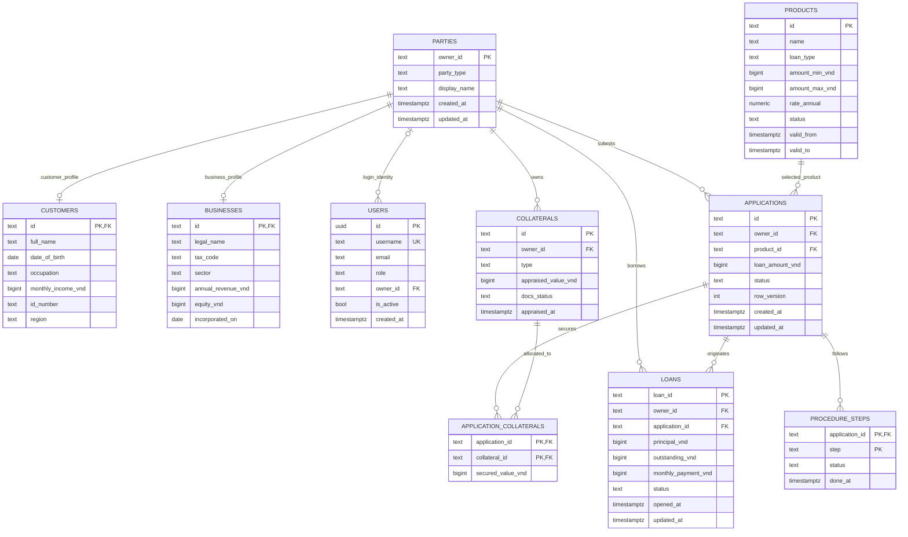
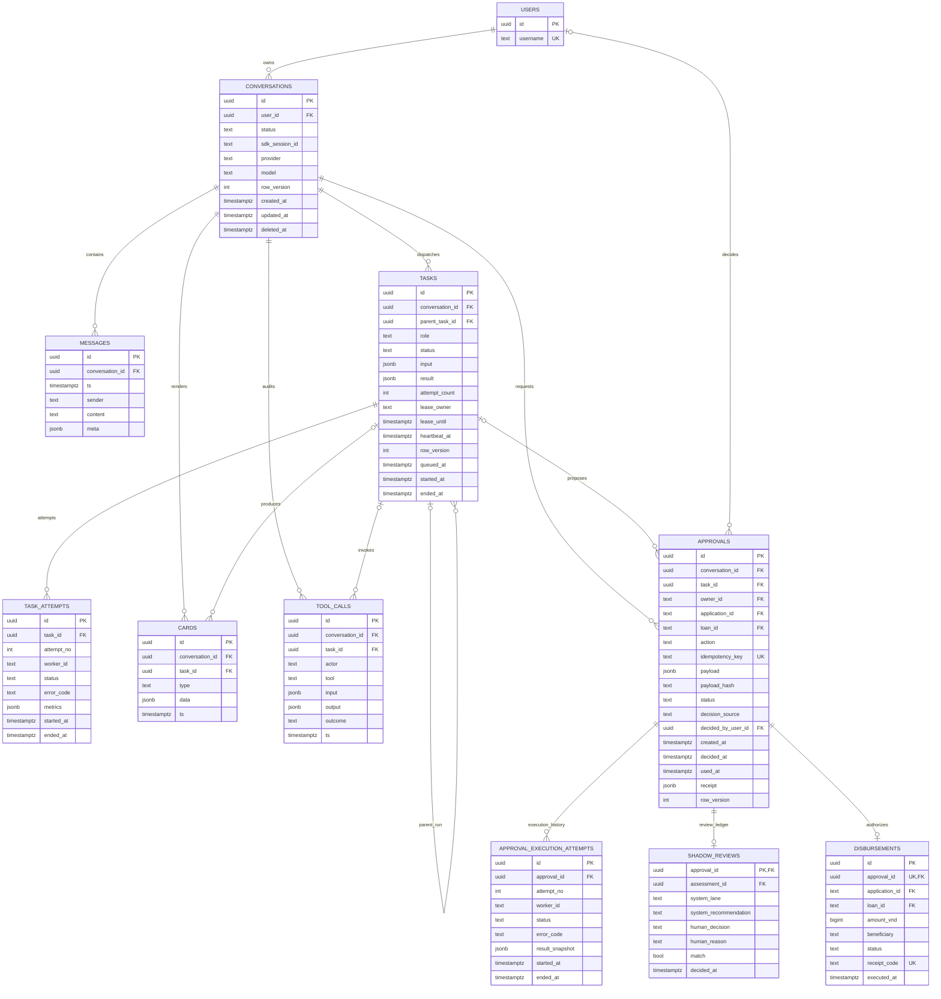

# DB ERD mục tiêu cho vận hành

> **Target dài hạn, đã áp dụng một phần.** Identity dual-reference, workflow lease/attempt/outbox,
> approval idempotency và prompt catalog đã được migrate tới `2f9c1a6e4d33` ngày 2026-08-24.
> Trạng thái vật lý chính xác nằm tại [`db-architecture-v2.md`](db-architecture-v2.md). Policy
> history, typed legacy timestamps, application-collateral và một số hard FK trong tài liệu này
> vẫn là backlog, không được đọc nhầm thành schema đang chạy.

Baseline ban đầu được đối chiếu từ live Postgres tại Alembic head `c8d4e6f1a290` và ERD cũ trong
`docs/db-erd-review.md`.

## Kết luận thiết kế

Không cần đổi khỏi Postgres 15. Cần đổi cách schema bảo vệ dữ liệu và cách runtime nhận việc:

- Postgres giữ định danh, quan hệ, idempotency và trạng thái chuẩn; code không còn là lớp duy nhất
  chặn orphan hoặc duplicate.
- Giữ `owner_id` hiện có làm mã nghiệp vụ, nhưng thêm `parties` làm cha chung cho customer và
  business để mọi bảng owner-scoped có đúng một FK.
- `conv_id` nội bộ trở lại UUID FK. API vẫn trả UUID dưới dạng string nên không cần đổi shape.
- Conversation dùng soft-delete/tombstone; nội dung có thể purge theo retention, còn approval,
  task metadata và tool audit vẫn giữ quan hệ hợp lệ.
- Approval có idempotency key riêng, không suy toàn bộ ý định từ payload hash; receipt vẫn nằm trên
  cùng approval row để giữ invariant tiền.
- Task có lease và attempt ledger nếu hệ thống được phép chạy nhiều worker hoặc cứu ca sau restart.
- Chính sách và dữ liệu kiểm tra phải có version/history để một quyết định cũ luôn tái dựng được.

## Thay đổi quan trọng so với DB hiện tại

| Hiện tại | Đích vận hành | Mục đích |
|---|---|---|
| `owner_id` trỏ mềm tới 2 bảng | `parties(owner_id)` làm cha chung | FK thật, không còn owner mồ côi |
| `conversations.user_id` là username text | `user_id uuid FK users.id` | đổi username không đứt lịch sử |
| `conv_id text` ràng buộc mềm | `conversation_id uuid FK` | chặn orphan runtime |
| Hard-delete conversation | soft-delete row, purge content riêng | giữ audit và FK hợp lệ |
| Approval key không unique | `idempotency_key` unique | chặn thực thi đôi ở DB |
| Approval chỉ giữ `exec_attempts` | thêm execution-attempt ledger | truy vết từng lần thử/lỗi |
| Task chỉ có status | lease, heartbeat, row version, attempts | claim an toàn giữa nhiều worker |
| `assumptions` key/value hiện hành | policy version + parameters | tái dựng quyết định lịch sử |
| CIC/police/employment ghi đè một row | append-only check history | audit được nguồn và thời điểm |
| Nhiều timestamp là text | `date` / `timestamptz` | query range, index và timezone đúng |
| Một collateral trên application | bảng nối application-collateral | hỗ trợ nhiều tài sản bảo đảm |
| Audit không có lifecycle | retention + partition theo thời gian | tránh bảng nóng phình vô hạn |

## ERD 1 - Identity và tín dụng



## ERD 2 - Conversation, worker và phanh duyệt



## ERD liên quan

Policy, pháp lý và retrieval được tách sang
[`db-erd-operational-supporting.md`](db-erd-operational-supporting.md) để mỗi bounded context đủ rõ
và các file giữ dưới giới hạn kích thước của repo.

## Constraint bắt buộc

- `approvals.idempotency_key` unique; orchestration boundary sinh key cho một business intent và
  phải dùng lại key đó khi retry. `payload_hash` chỉ kiểm tra payload không bị thay đổi.
- Check constraint trên approval: `status='used'` khi và chỉ khi `receipt IS NOT NULL` và
  `used_at IS NOT NULL`. Trước khi bật check này, `gated.py` phải lock row rồi ghi
  `status + receipt + used_at` trong cùng câu `UPDATE`; cách set `used` trước rồi bổ sung receipt
  hiện tại sẽ bị constraint chặn dù vẫn nằm trong một transaction.
- `disbursements.approval_id` unique, `receipt_code` unique, amount lớn hơn 0 và chính xác một trong
  `application_id`/`loan_id` phải có giá trị.
- `decision_source='human'` yêu cầu `decided_by_user_id`; `auto_rule` yêu cầu field này null.
- Tất cả status/lane/role có check constraint hoặc bảng mã; không dùng PostgreSQL enum để migration
  trạng thái mới vẫn dễ.
- `task_attempts(task_id, attempt_no)` và
  `approval_execution_attempts(approval_id, attempt_no)` unique.
- Chỉ một execution attempt của mỗi approval được có trạng thái thành công bằng partial unique
  index; `policy_versions(policy_code, version)` cũng phải unique.
- Mọi amount VND không âm; ownership percent nằm trong `[0, 100]`.
- Audit role chỉ có `INSERT/SELECT` trên `tool_calls` và attempt ledgers; reset/purge dùng DB role
  riêng, không dùng credential runtime.

## Index tối thiểu

```sql
conversations (user_id, created_at DESC) WHERE deleted_at IS NULL
messages      (conversation_id, ts, id)
tasks         (status, queued_at) WHERE status = 'queued'
tasks         (conversation_id, queued_at)
cards         (conversation_id, ts, id)
tool_calls    (conversation_id, ts DESC)
tool_calls    (task_id, ts)
approvals     UNIQUE (idempotency_key)
approvals     (status, created_at) WHERE status = 'pending'
approvals     (owner_id, status, decided_at DESC)
applications  (owner_id, status, created_at DESC)
cic_records   (owner_id, checked_at DESC)
interaction_notes (owner_id, ts DESC)
```

`messages`, `tool_calls` và attempt ledgers chỉ partition theo tháng sau khi kích thước/index hoặc
retention thực tế yêu cầu. Khi partition theo thời gian, PK/unique index phải chứa partition key;
không thể bê nguyên `id PK` hiện tại sang partitioned table.

## Thứ tự triển khai an toàn

1. Chốt lại SPEC §12/§14, D-31 và D-67 trước khi code: một hay nhiều worker, có cứu task qua
   restart không, conversation là hard-delete hay tombstone.
2. Migration additive: tạo `parties`, policy tables, attempt tables và các cột mới nullable.
3. Backfill, chạy orphan/duplicate report; không tự xóa dữ liệu sai.
4. Tạo index, FK dạng `NOT VALID`, rồi `VALIDATE CONSTRAINT` sau khi dữ liệu sạch.
5. Dual-write cột cũ/mới trong một release; đổi read path ở release tiếp theo.
6. Đổi money path sang lock row và final-update `status + receipt + used_at` cùng lúc.
7. Enforce `NOT NULL`, unique và check constraints khi mọi writer đã chuyển.
8. Chỉ drop cột cũ sau ít nhất một release rollback window.

## Preflight DB hiện tại

Kiểm tra read-only ngày 2026-08-24 cho thấy owner data sẵn sàng để backfill `parties`: không có
owner trùng giữa customer/business và không có owner reference mồ côi. Approval cũng không có key
trùng, không vi phạm `used/receipt/used_at`.

Runtime data chưa sẵn sàng bật FK: có 54 approvals, 76 cards, 14 tasks, 27 tool calls và 16
shadow reviews thiếu conversation cha; 4 shadow reviews còn thiếu approval cha. Phần lớn ID có
prefix fixture như `gated-*`, `appr-*`, `c-*`. Phải tách `TEST_DATABASE_URL`, reset/phân loại dữ
liệu dev và đưa orphan report về 0 trước khi validate FK; tài liệu này không tự xóa row nào.

## Phạm vi theo ưu tiên

- **P0 - DB vận hành tốt với một worker:** `parties`, FK/check, idempotency key, typed timestamps,
  index đúng query, policy version và DB roles.
- **P1 - scale ngang:** task lease/heartbeat/attempt, soft-delete conversation, giữ task metadata,
  claim bằng `FOR UPDATE SKIP LOCKED`. P1 buộc đổi SPEC vì hiện repo chủ động không cứu ca restart.
- **P2 - dữ liệu lớn:** retention, monthly partition, standby/read replica; `pgvector` chỉ khi có
  số đo chứng minh cần.

Không nên áp toàn bộ ERD này trong một migration. P0 có thể triển khai độc lập và đem lại phần lớn
lợi ích về toàn vẹn dữ liệu; P1 chỉ đáng làm khi mục tiêu vận hành thật sự là nhiều worker.
