# DB ERD review

> **Baseline trước D-76.** DB live đã được migrate từ `c8d4e6f1a290` lên `2f9c1a6e4d33` ngày
> 2026-08-24. ERD và đánh giá hiện hành nằm tại
> [`db-architecture-v2.md`](db-architecture-v2.md); file này được giữ để đối chiếu trước/sau.

Nguon kiem tra: live Postgres `shb` qua `docker compose exec db psql`, Alembic head
`c8d4e6f1a290`, doi chieu `backend/app/db/migrations/versions/` va `backend/app/db/models.py`.
Repo hiện có skill `.codex/skills/database-erd/` để tái tạo ERD trực tiếp từ live catalog.

## Tong quan live DB

- 29 bang ung dung, 214 cot, 40 index.
- DB dang o Alembic head `c8d4e6f1a290` (S18 shadow review).
- DB co 5 check constraint nghiep vu: `approvals.system_lane`,
  `approvals.system_recommendation`, va 3 constraint tuong ung tren `shadow_reviews`.
- Gan nhu khong co FK cung sau D-31/D-67. Cac quan he duoi day la soft-reference theo cot
  nghiep vu (`conv_id`, `owner_id`, `task_id`, `approval_id`, `application_id`...).

## ERD

```mermaid
erDiagram
  USERS {
    uuid id PK
    varchar username UK
    text pass_hash
    text role
    text owner_id
    text email
    text google_sub UK
  }

  CONVERSATIONS {
    uuid id PK
    text user_id
    text title
    text status
    text sdk_session_id
    timestamptz created_at
    text provider
    text model
  }

  MESSAGES {
    uuid id PK
    text conv_id
    timestamptz ts
    text sender
    text content
    jsonb meta
  }

  TASKS {
    uuid id PK
    text conv_id
    text role
    text title
    text status
    jsonb input
    jsonb result
    timestamptz queued_at
    timestamptz started_at
    timestamptz ended_at
    jsonb cost
    bigint input_tokens
    bigint output_tokens
    bigint cache_read_tokens
    bigint cache_create_tokens
    bigint duration_ms
    text model
  }

  CARDS {
    uuid id PK
    text conv_id
    uuid task_id
    text type
    jsonb data
    timestamptz ts
  }

  TOOL_CALLS {
    uuid id PK
    uuid task_id
    text conv_id
    timestamptz ts
    text actor
    text tool
    jsonb input
    jsonb output
    jsonb cost
  }

  APPROVALS {
    uuid id PK
    text conv_id
    uuid task_id
    text action
    jsonb payload
    text payload_hash
    text status
    text decided_by
    timestamptz decided_at
    text reason
    timestamptz used_at
    jsonb receipt
    int exec_attempts
    int system_assessment_id
    text system_lane
    text system_recommendation
  }

  SHADOW_REVIEWS {
    uuid approval_id PK
    text conv_id
    text system_lane
    text system_recommendation
    text human_decision
    text human_reason
    timestamptz decided_at
    bool match
  }

  CUSTOMERS {
    varchar id PK
    text full_name
    int age
    text occupation
    bigint monthly_income
    text region
    text id_number
    text address
    text segment
  }

  BUSINESSES {
    varchar id PK
    text name
    text sector
    bigint annual_revenue
    bigint equity
    int years_operating
    text tax_code
    text address
  }

  LOANS {
    varchar loan_id PK
    varchar owner_id
    bigint principal
    bigint outstanding
    bigint monthly_payment
    text status
  }

  CIC_RECORDS {
    varchar owner_id PK
    int cic_group
    text history_note
  }

  COLLATERALS {
    varchar id PK
    varchar owner_id
    text type
    bigint appraised_value
    text docs_status
  }

  ASSUMPTIONS {
    varchar key PK
    text value
  }

  LEGAL_REQUIREMENTS {
    text loan_type PK
    text doc_code PK
    text doc_name
    int mandatory
  }

  OWNER_DOCUMENTS {
    varchar owner_id PK
    text doc_code PK
    text status
  }

  COLLATERAL_LEGAL {
    varchar collateral_id PK
    text dispute_status
    text zoning_status
    text note
  }

  RESTRICTED_PURPOSES {
    text purpose_code PK
    text purpose_name
    text restriction
    text legal_basis
  }

  POLICE_RECORDS {
    text owner_id PK
    text id_number
    text full_name
    text address
    text criminal_status
    text record_type
    int record_year
    text notes
  }

  EMPLOYMENT_RECORDS {
    text owner_id PK
    text employer
    text position
    int tenure_months
    bigint verified_income_vnd
    text status
    text verified_at
  }

  ASSESSMENTS {
    int id PK
    text owner_id
    text loan_type
    bigint loan_amount_vnd
    text lane
    text criteria_json
    text basis
    text created_at
  }

  PRODUCTS {
    text id PK
    text name
    text loan_type
    float rate_annual
    int term_max_months
    bigint amount_min_vnd
    bigint amount_max_vnd
    float fee_pct
    bigint income_min_vnd
    int cic_max_group
    text segment
    text status
    text note
  }

  APPLICATIONS {
    text id PK
    text owner_id
    text product_id
    bigint loan_amount_vnd
    text loan_type
    text collateral_id
    text status
    int credit_ok
    int legal_ok
    text human_approval
    text approval_ref
    text created_at
  }

  DISBURSEMENTS {
    text id PK
    text application_id
    bigint amount_vnd
    text beneficiary
    text status
    text executed_at
    text receipt_code
  }

  PROCEDURE_STEPS {
    text application_id PK
    text step PK
    text status
    text done_at
  }

  WIKI_PAGES {
    text id PK
    text role
    text title
    text topic
    text tags
    text legal_basis
    text effective_from
    text effective_to
    text status
    text body
    text source_file
    text so_hieu
    text dieu
    text amended_by
    text source_url
    text crawled_at
  }

  WIKI_LINKS {
    text from_page PK
    text to_page PK
  }

  INTERACTION_NOTES {
    int note_id PK
    text owner_id
    text ts
    text channel
    text rm
    text note_text
    bytea embedding
  }

  PARTY_RELATIONS {
    text from_id PK
    text to_id PK
    text relation PK
    float pct
  }

  USERS ||--o{ CONVERSATIONS : soft_user_id_username
  CONVERSATIONS ||--o{ MESSAGES : soft_conv_id
  CONVERSATIONS ||--o{ TASKS : soft_conv_id
  CONVERSATIONS ||--o{ CARDS : soft_conv_id
  CONVERSATIONS ||--o{ TOOL_CALLS : soft_conv_id
  CONVERSATIONS ||--o{ APPROVALS : soft_conv_id
  CONVERSATIONS ||--o{ SHADOW_REVIEWS : soft_conv_id

  TASKS ||--o{ CARDS : soft_task_id
  TASKS ||--o{ TOOL_CALLS : soft_task_id
  TASKS ||--o{ APPROVALS : soft_task_id
  APPROVALS ||--o| SHADOW_REVIEWS : soft_approval_id
  ASSESSMENTS ||--o{ APPROVALS : soft_system_assessment_id

  CUSTOMERS ||--o{ LOANS : soft_owner_id
  BUSINESSES ||--o{ LOANS : soft_owner_id
  CUSTOMERS ||--o{ CIC_RECORDS : soft_owner_id
  BUSINESSES ||--o{ CIC_RECORDS : soft_owner_id
  CUSTOMERS ||--o{ COLLATERALS : soft_owner_id
  BUSINESSES ||--o{ COLLATERALS : soft_owner_id
  COLLATERALS ||--o| COLLATERAL_LEGAL : soft_collateral_id

  CUSTOMERS ||--o{ OWNER_DOCUMENTS : soft_owner_id
  BUSINESSES ||--o{ OWNER_DOCUMENTS : soft_owner_id
  LEGAL_REQUIREMENTS ||--o{ OWNER_DOCUMENTS : soft_doc_code
  CUSTOMERS ||--o| POLICE_RECORDS : soft_owner_id
  BUSINESSES ||--o| POLICE_RECORDS : soft_owner_id
  CUSTOMERS ||--o| EMPLOYMENT_RECORDS : soft_owner_id
  BUSINESSES ||--o| EMPLOYMENT_RECORDS : soft_owner_id
  CUSTOMERS ||--o{ ASSESSMENTS : soft_owner_id
  BUSINESSES ||--o{ ASSESSMENTS : soft_owner_id

  PRODUCTS ||--o{ APPLICATIONS : soft_product_id
  CUSTOMERS ||--o{ APPLICATIONS : soft_owner_id
  BUSINESSES ||--o{ APPLICATIONS : soft_owner_id
  COLLATERALS ||--o{ APPLICATIONS : soft_collateral_id
  APPLICATIONS ||--o{ DISBURSEMENTS : soft_application_id
  APPLICATIONS ||--o{ PROCEDURE_STEPS : soft_application_id

  WIKI_PAGES ||--o{ WIKI_LINKS : soft_from_page
  WIKI_PAGES ||--o{ WIKI_LINKS : soft_to_page
  CUSTOMERS ||--o{ INTERACTION_NOTES : soft_owner_id
  BUSINESSES ||--o{ INTERACTION_NOTES : soft_owner_id
  CUSTOMERS ||--o{ PARTY_RELATIONS : soft_from_or_to
  BUSINESSES ||--o{ PARTY_RELATIONS : soft_from_or_to
```

## Row counts tai thoi diem kiem tra

| Bang | Rows |
|---|---:|
| interaction_notes | 2215 |
| wiki_links | 309 |
| wiki_pages | 82 |
| owner_documents | 73 |
| cic_records | 35 |
| police_records | 32 |
| customers | 30 |
| employment_records | 28 |
| loans | 23 |
| tool_calls | 21 |
| cards | 16 |
| assumptions | 15 |
| approvals | 14 |
| products | 13 |
| collateral_legal | 8 |
| collaterals | 8 |
| party_relations | 8 |
| applications | 7 |
| restricted_purposes | 6 |
| users | 6 |
| conversations | 4 |
| messages | 4 |
| procedure_steps | 4 |
| disbursements | 2 |
| tasks | 2 |
| assessments | 1 |
| shadow_reviews | 0 |

## Danh gia

### Diem tot

- `approvals` dung vai tro trung tam cho phanh: `(conv_id, action, payload_hash)` co index rieng,
  `receipt` nam cung row voi `status='used'`, `exec_attempts` chan loop re-dispatch.
- `shadow_reviews` co PK `approval_id`, giup atomic decision ledger: mot approval chi co mot mau
  doi soat.
- Cac bang audit/render (`messages`, `tasks`, `cards`, `tool_calls`, `approvals`) dung `conv_id`
  thong nhat, phu hop SSE/refetch va Control Tower.
- Retrieval va world data tach domain ro: wiki, notes vector BLOB, relation graph, product/ops
  pipeline khong tron vao bang chat.
- Default DB-level `gen_random_uuid()` da co tren cac bang he thong quan trong, an toan cho raw
  psycopg2 insert.

### Rui ro / trade-off can biet

- Soft-reference rat nhieu va DB khong enforce FK. Day la quyet dinh co chu dich, nhung mat trai
  la du lieu mo coi chi duoc bat bang test/query audit, khong duoc DB chan tu dong.
- `approvals.ix_approvals_key` khong unique. Advisory lock + branch pending/used dang giu idempotency
  o tang code; neu co duong ghi truc tiep vao DB, duplicate pending cung key van co the xay ra.
- `shadow_reviews.approval_id` khong co FK toi `approvals.id`. PK chan double insert, nhung khong
  chan review mo coi neu co SQL ngoai service.
- `users.owner_id`, `loans.owner_id`, `applications.owner_id`, `interaction_notes.owner_id`,
  `party_relations.from_id/to_id` deu tro vao khong gian owner gom ca `customers` va `businesses`.
  Day la mo hinh linh hoat, nhung can guard doc/ghi that chat vi DB khong the FK vao hai bang.
- Nhieu cot thoi gian trong bang nghiep vu LAB la `text` (`created_at`, `verified_at`, `executed_at`,
  wiki effective dates). Tot cho port byte-identical, kem hon cho query date/range va index sau nay.
- `backend/app/db/models.py` chua model hoa tat ca bang migration moi (`products`, `applications`,
  retrieval, legal 3 tru...). Neu dung ORM/autogenerate de suy schema se thieu mot phan DB that.

### Khuyen nghi uu tien

1. Them mot test/readiness read-only kiem tra orphan cho cac soft-reference chinh:
   `tasks/cards/tool_calls/approvals -> conversations`, `cards/tool_calls/approvals -> tasks`,
   `shadow_reviews -> approvals`, `applications/disbursements/procedure_steps`.
2. Can nhac partial unique index cho approval idempotency neu phu hop voi history:
   `(conv_id, action, payload_hash)` cho status dang song (`pending`, `approved`, `used`) hoac it
   nhat cho `pending`/`approved`. Neu giu multi-history, ghi ro ly do khong unique.
3. Bo sung tai lieu schema owner-id polymorphic: field nao co the tro `customers.id` hoac
   `businesses.id`, field nao chi la customer.
4. Neu tiep tuc dung SQL raw la chinh, can tao file `docs/db-invariants.md` ngan gom cac invariant
   DB song con: approval state machine, receipt atomicity, soft-reference cleanup, read-scope.
5. Cap nhat `backend/app/db/models.py` hoac ghi ro day khong phai source-of-truth day du, de tranh
   nguoi sau dung ORM models lam ERD sai.
