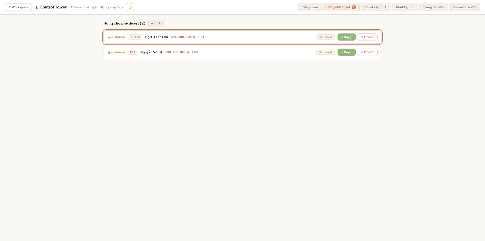

# Sprint 19 — End (External-chat doorbell + exact-ticket deep-link)

**Status (2026-08-24): CLOSED.** Every Sprint 19-specific implementation and integrated gate
passed, and the upstream Sprint 18 live-model memo gate is now closed.

## Results

- **T19-1 — Outbound adapter:** generic and Lark notifications use contract-frozen allowlists,
  default to no amount, run best-effort after commit/SSE, and retry at most three attempts with
  1s/3s backoff and a 5s request timeout. Delivery failure cannot change the approval response;
  secret-safe logs omit webhook URLs, headers, bodies, and business data.
- **T19-2 — Exact ticket:** admin-only `GET /api/approvals/{id}` reads pending and final states.
  `/?tab=approvals&approval=<id>` preserves a safe relative path through password/Google auth,
  merges the exact ticket without duplication, highlights and scrolls it, and retains a decided
  row after action. Customer/user paths mount no Tower and make zero approval-list/detail calls.
- **T19-3 — Runbook/config:** the three webhook variables are documented in the sample and
  production compose configuration. Deployment guidance states the bank-DC boundary, opt-in
  amount rule, best-effort behavior, rollback, and the D-71 rule: chat is a doorbell, never an
  approval surface.

## Real receiver and lifecycle evidence

- A controlled `ThreadingHTTPServer` received the pending event in **43.544ms** and the approved
  event in **13.265ms**.
- Each observed generic body contained exactly four keys: `action`, truncated `conv_id`, `status`,
  and `deep_link`. It contained no amount, loan/customer data, reason, CIC, or receipt.
- The corresponding `shb_test` lifecycle reached `pending → approved → used`; the loan became
  `disbursed`. Immediate replay returned the identical receipt and the real execution count stayed
  `1 → 1`.
- The exact-ticket API and money lifecycle were verified separately against the real backend and
  PostgreSQL test database; webhook cleanup left zero gate rows and restored the threshold key to
  absent.

## Browser evidence and environment disclosure

The browser check proves that the approval tab opens and the exact ticket receives the focus
highlight while the pending heading/badge remains correct. This visual login/focus pass used the
Vite mock API because local port `8000` belonged to an unrelated service and was not safe to
replace. It is UI evidence only. Authorization, exact-ticket API states, shadow rows, webhook
events, and the disbursement lifecycle were independently exercised against the real backend on
`shb_test`.

## Verification

- Backend: **504 collected = 487 passed + 17 skipped**.
- Frontend: **29 files / 251 passed** under Node 26 with
  `NODE_OPTIONS=--no-experimental-webstorage`; typecheck passed.
- Combined: **738 passed + 17 skipped**, zero failures.
- Deep-link tests cover generic canonical UUIDs (including UUIDv7), malformed/duplicate params,
  anonymous password continuation, encoded Google `next`, customer/user zero-fetch, decided-row
  retention, and fail-soft exact-ticket 404 with the ordinary pending queue still usable.

## Gate verdict

- [x] Pending and decided doorbells reached a real receiver within five seconds.
- [x] Payload allowlist/data-minimization and no approve-from-chat boundary.
- [x] Auth-preserved exact-ticket focus, including final states and non-disclosure paths.
- [x] Real `pending → approved → used` lifecycle and exactly-once receipt replay.
- [x] Full backend/frontend suites at or above the S18 checkpoint.
- [x] Required upstream Sprint 18 gate closed.

**Verdict:** all Sprint 19 gates passed; Sprint 19 is **closed**.
